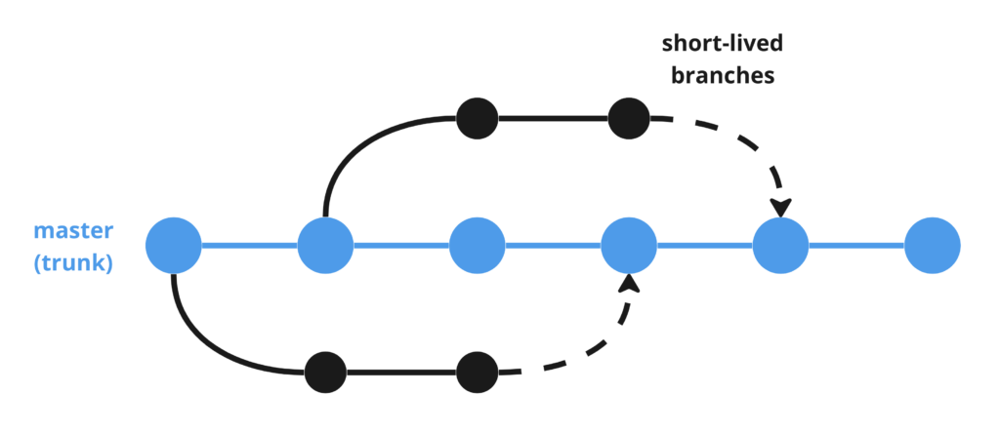

## Plano de Gerência de Configuração de Software (BI-SETDIG)

## Versionamento
|Versao|data criacao|descricao|
|:----------:|----------------:|:--------------|
|1.0|2026-09-02|Criacao do MarkDown|

## Contexto 
Formalizar e padronizar, ferramentas e métodos utilizado na evolução e correção do código fonte do (BI-SETDIG).

## Introdução
 Nesse MarkDown estará todas ás informações das rotinas e processos que a equipe deverá seguir para commitar no github, sem perder a qualidade e eficiencia do código e trazendo mais segurança na entrega.  

## Definições, Acrônimos e Abreviações
|Termo|Definição|
|:----:|:----|
|**GCS**|Gerência de Configuração de Software|
|**PGCS**|Plano de Gerência de Configuração de Software|
|**IC**|Item de Configuração - Artefato sob controle de versão|
|**PR**|Pull Request - Solicitação de integração de código|

## Escopo 
Esse Plano é voltado a equipe de análise e desenvolvimento, e estará relacionado com o código fonte e a atualização do código, portanto seu ciclo será até a morte do projeto.

## Objetivos 
Trazer mais confiabilidade na qualidade dos códigos subidos, e evitar erros de versão;

## Ferramentas
- **Git** -> como sistema de controle de versão;
- **GitHub** -> como plataforma de hospedagem e colaboração;
- **GitHub Issues** -> para registro e acompanhamento de mudanças;
- **Pull Requests** -> para revisão e integração de código;

## Nomenclaturas da branches
|Tipo|Prefixo Formato|Principal|
|:----:|:--------:|:----------|
|Main|main|main|
|Funcionalidade|feature/|feature/decricaoDaFeature|

## Consequências 
Nas Políticas de Commit os commits devem ser frequentes, focados em alterações lógicas isoladas e seguir estritamente o padrão Convencional Commits, auditado automaticamente via Commitlint.

## Tipos de commits semânticos
|Tipo|Uso|
|:-----:|:------|
|**Feat**|Nova funcionalidade|
|**Fix**|Correção de bug|
|**Docs**|Alteração em documentação|
|**Style**|Formatação de código (sem mudança lógica)|
|**Refactor**|Mudança interna sem alterar comportamento|
|**Perf**|Melhoria de desempenho|
|**Test**|Adição ou correção de testes|
|**Build**|Mudanças no sistema de build|
|**Ci**|Alterações em CI/CD|
|**Chore**|Manutenção de ferramentas ou tarefas|
|**Env**|Configurações de ambiente|

## Regras de Versionamento e Branches
- **Modelo de branches** - Trunk Based. Utilizaremos esse modelo, por a equipe conseguir documentar todas os commits feitos no repositorio e porque a equipe utilizara apenas a estrutura de feature e main, e realiará varios commits no dia. Utilizaremos o modelo pessimista, no repositorio para não dar
erros de mesclagem de codigo, quando um dev for atualizar um modulo do projeto por exemplo(MS Digital, Cartas de Serviços), o dev dereverá trancar esse modulo para fazer suas alterações sem prejudicar o restante da equipe mas a equipe poderá ver o codigo daquele modulo mas não poderá alterar.  

- **Main** - Commits não deverão ser realizados diretamente nessa branch, features commitadas deverão fazer uma PR,
 para passar por testes automatizados, para verificar a qualidade, bugs e se não irá quebrar a brainch main por exemplo(versões diferentes de blibiotecas).

- **Feature** - As feature que foram commitadas deverão criar issues em suas branchs para explicar, o que foi implantando, mudado ou corrigido no codigo,
e qual o motivo de tal alteração, contendo informações de quem subiu o codigo. Tambem deverá existir um PR para a branch main, mas uma feature não deverá
conter mais de 4 PRs para se caso a feature aprensentar problemas, o erro será menos complicado de achar ou menos complexo de modificar o codigo, em relação a isso outra feature deverá ser criada sendo um espelho da branch main.

